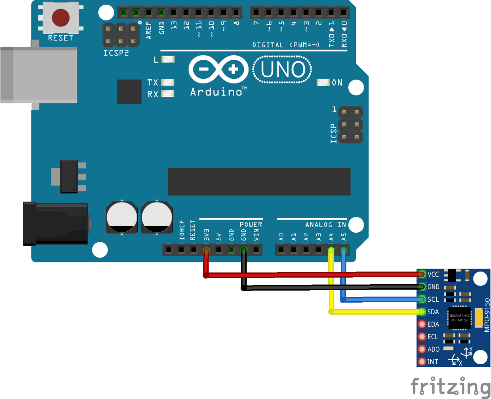
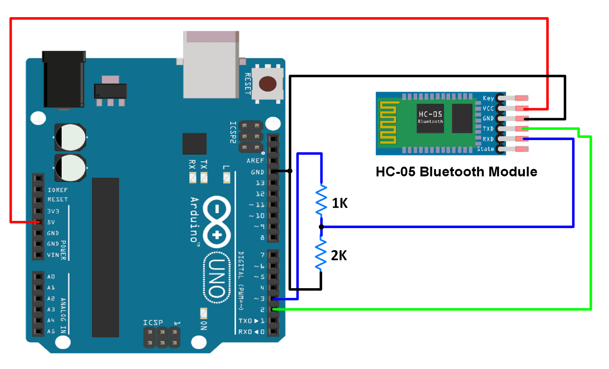

# Smart Alarm

## Intro

* Are you struggling to wake up in the morning? You know you have an important day ahead, but you can't seem to wake up on time.
* Have you tried several methods to wake up but they all stop working?
* Is your bed just too comfortable to leave?
* Smart alarm is just the thing for you!

## What is it?

* Smart alarm is a band that goes around your ankle and tells your alarm clock if you are up and out of bed. If you lay back down within a set timeframe your alarm will start going off again.

## Who is it for?

* Professionals with a tight schedule
* Teenagers
* Parents of teenagers
* YOU!

## How does it work

* The Smart alarm technology is built with an Arduino, an MPU-9150 Inertial Measurement Unit, a bluetooth chip, and an app on a smart phone.
* You, the inventor, will build the app and the smart band using your Arduino kit, your phone and some supplies around your home.
  
* ADD IMAGE OF OVERALL FLOW

### Supplies

* Supplies needed for the prototyle:
  * Arduino (This tutorial uses an Arduino Uno) [Buy Here](https://store.arduino.cc/usa/arduino-uno-rev3) or [Buy a Starter Kit here](https://store.arduino.cc/usa/arduino-starter-kit?gclid=CjwKCAiAsOmABhAwEiwAEBR0Zj1H2rDtV18fRGTIhXi4Hjs5I6sufcSjp_RIBC1feaUfHefz6OET7xoCFagQAvD_BwE)
  * MPU-9150 Intertial Measurement Unit [Buy Here](https://www.amazon.com/gp/product/B01I1J0Z7Y/ref=ppx_yo_dt_b_asin_title_o08_s00?ie=UTF8&psc=1)
  * HC-05 Bluetooth Module [Buy Here](https://www.amazon.com/gp/product/B07VL725T8/ref=ppx_yo_dt_b_asin_title_o07_s00?ie=UTF8&psc=1)
  * Computer to develop code
  * Development software for the phone app
    * Android Studio for Android phones [Download Here](https://developer.android.com/studio)
    * or XCode for iPhones[Download Here](https://developer.apple.com/xcode/)
  * USB cable to attach your phone to your computer
  * Arduino IDE and Drivers [Download Here](https://www.arduino.cc/en/software)
  * Wires
  * Bread Board
* You will also need these next items if you would like to make the "finished product"
  * Soldering Iron and Solder Wire
  * Microcontroller [Buy Here](https://www.google.com)
  * Elastic
  * Needle and Thread
  * Battery pack

### Schematics for Prototype

* Below is an image of how the MPU-9150 Inertial Measurement Unit should be hooked up to your Arduino
  
* Below is an image of how the Bluetooth Module should be hooked up to your Arduino
  

### Steps

Step 1: Install Necessary Development Software
    1. Arduino IDE
    2. Android Studio OR XCode

Step 2: Attach Arduino to Computer and Test Connectivity

Step 3: Attach the MPU-9150 unit to the arduino using the schematic above

Step 4: Upload Inertial Unit code to the Arduino

Step 5: Move the MPU-9150 around and watch the numbers in the serial console change

Step 6: Attach the Bluetooth Module using the schematic above

Step 7: Upload Inertial Unit code to the Arduino

Step 8: Connect Bluetooth Module to Phone

Step 9: Open phone app code in appropriate IDE and test it in the emulator

Step 10: Upload code to phone and test

Step 11: Upload Final Alarm Code to Arduino

Step 12: Test complete prototype

NOTE: If you are just building the prototype, you are done. If you would like to learn more about soldering and microcontrollers, continue.

### Schematics for Finished Product

NONE YET

### Additional Steps

Step 13: Attach the Microcontroller to the Arduino using the schematic above

Step 14: Upload code to the Microcontroller

Step 15: Attach the MPU-9150 to Microcontroller using the schematic above

Step 16: Attach the Bluetooth Module to the Microcontroller using the schematic above

Step 16: Attach the Battery Pack to the Microcontroller using the schematic above

Step 17: Solder the Connections

Step 18: Test the product

Step 19: Sew the microcontroller and parts to an elastic band

Step 20: DONE!
